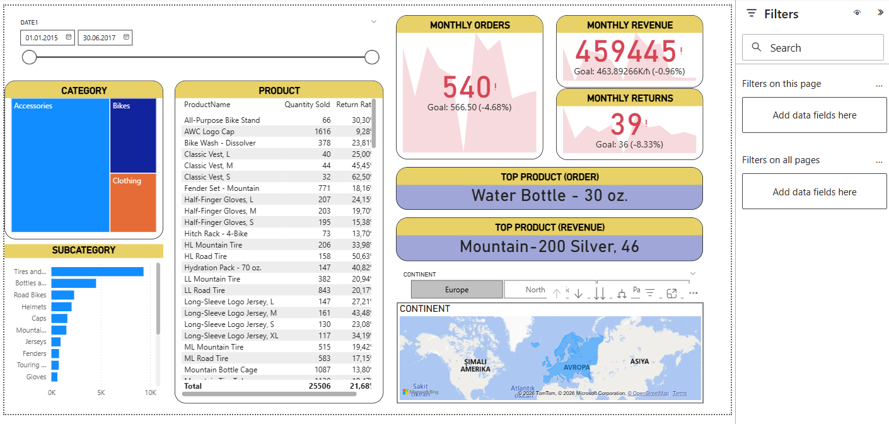

# Sales & Customer Analytics Dashboard (Power BI)

## Project Description
This Power BI dashboard analyzes historical sales, product performance, and customer data from 2015 to 2017. It provides insights into sales trends, top-performing products, and customer behavior to support data-driven decision-making.

## Tools Used
- Power BI
- Data Modeling
- Data Visualization

## Key Insights
- Identified sales trends between 2015 and 2017
- Discovered top-selling products
- Analyzed customer distribution and purchasing behavior

## Dashboard Features
- Sales overview
- Product performance analysis
- Customer insights
  
## Dashboard Preview

